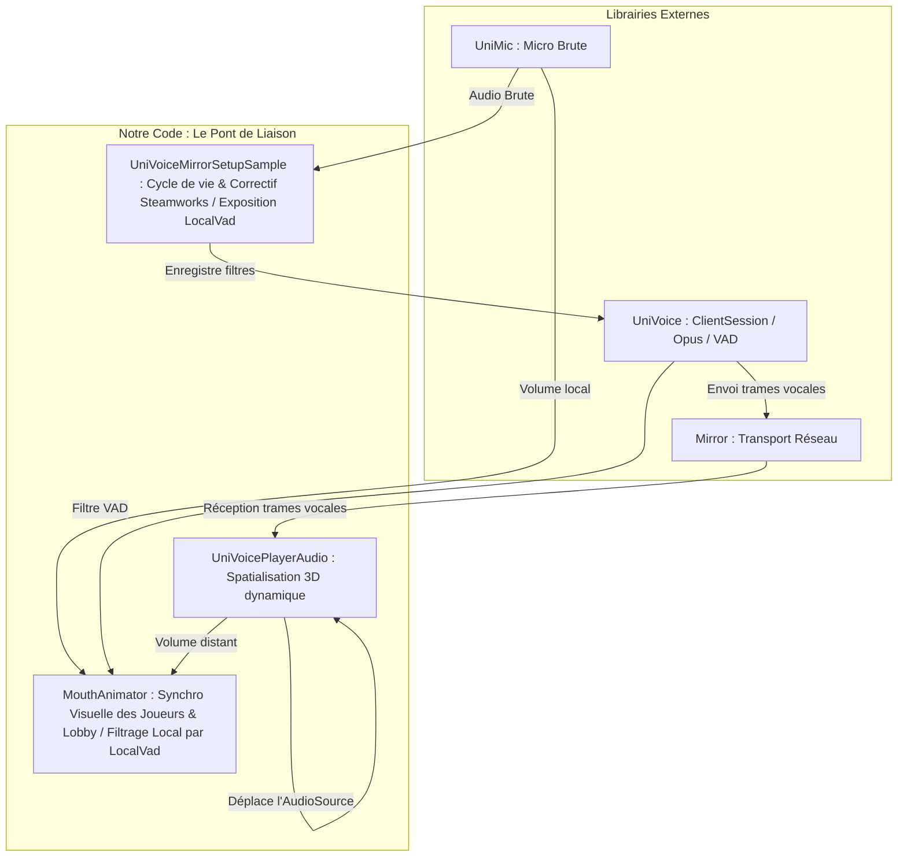

# Voice System & VoIP Bridge

This system provides real-time Voice over IP (VoIP) with 3D spatialization and character mouth animations in multiplayer sessions.

---

## 1. Démystification de la Détection d'Activité Vocale (VAD)

La **Voice Activity Detection (VAD)** est un algorithme qui analyse en temps réel le signal audio du microphone pour déterminer si l'utilisateur est en train de parler ou s'il s'agit de bruit de fond (bruit blanc, souffle, ventilateur).

### Fonctionnement Interne (SimpleVad)
L'algorithme fourni par le package **UniVoice** (`SimpleVad.cs`) fonctionne ainsi :
1. **Énergie RMS** : Il calcule l'énergie moyenne quadratique (Root-Mean-Square) de la trame audio PCM reçue.
2. **Estimation du bruit adaptatif** : À l'aide d'une moyenne mobile exponentielle (EMA), il estime en continu le niveau du bruit de fond ambiant pendant les moments de silence.
3. **Calcul du SNR (Rapport Signal/Bruit)** : Il calcule la différence en décibels (dB) entre l'énergie de la trame actuelle et le bruit de fond estimé.
4. **Hystérésis et Seuils** :
   - Pour passer à l'état "parle" (`IsSpeaking`), le SNR doit dépasser le seuil d'entrée (`SnrEnterDb`, par défaut 8 dB).
   - Pour repasser à l'état "silence", le SNR doit descendre en dessous du seuil de sortie (`SnrExitDb`, par défaut 4 dB).
5. **Anti-oscillations (Timers)** :
   - **AttackMs** : Temps minimal pendant lequel la voix doit être détectée en continu pour déclencher l'animation/l'envoi.
   - **ReleaseMs** : Temps d'attente (hangover) après la parole pour éviter que la transmission ne coupe brutalement à la fin d'une phrase.
   - **MaxGapMs** : Autorise de brèves pauses de parole sans couper l'état.

---

## 2. Délimitation des Rôles : Librairies Existantes vs Code Créé

### A. Ce qui était déjà fourni par les Packages (Out-Of-The-Box)

* **Mirror** : Le framework de mise en réseau Unity. Il gère les connexions client/serveur, la réplication des entités (`[SyncVar]`, `NetworkIdentity`) et le transport bas niveau des paquets réseau.
* **UniVoice (Core Library)** : 
  * La capture matérielle du microphone via le sous-système `UniMic`.
  * La structure de session `ClientSession` gérant les flux entrants et sortants.
  * Les filtres de trame : `ConcentusEncodeFilter` et `ConcentusDecodeFilter` (encodage/décodage Opus) et `SimpleVadFilter` (le composant VAD décrit ci-dessus).
  * Les classes de transport réseau intégrées pour Mirror (`MirrorClient` et `MirrorServer`), qui permettent de sérialiser les trames vocales compressées et de les envoyer via le canal de transport de Mirror.

### B. Ce que NOUS avons programmé (Notre Pont & Intégration)

Comme **UniVoice** est conçu de façon générique et agnostique du jeu, il n'a aucune notion de position dans l'espace 3D, de GameObjects joueurs ou de rendu visuel. Nous avons écrit les scripts pour faire le pont ("bridge") entre la voix réseau et le gameplay de *VacuumProtocol*.

#### 1. Le Gestionnaire de Session & Correctif de Lobby ([UniVoiceMirrorSetupSample.cs](file:///c:/Users/celestin/Unity%20Games/VacuumProtocol/Assets/1_Scripts/Audio/UniVoiceMirrorSetupSample.cs))
* **Rôle** : Initialise la session UniVoice, configure le périphérique micro local, et applique la chaîne de traitement (VAD + Encodage Concentus Opus).
* **Notre contribution** :
  * **Pourquoi avoir une copie locale ?** : Le script original du package est situé dans le cache en lecture seule de Unity (`Library/PackageCache/...`). Nous l'avons extrait localement dans nos scripts afin d'y ajouter nos propres fonctionnalités d'intégration sans écraser le package de base.
  * **Correctif Steamworks** : En multijoueur via Steam, le Host ID est parfois mal assigné à `-1`. Nous avons programmé une vérification à chaque frame pour forcer l'ID de l'hôte à `0` via réflexion C# afin de ne pas bloquer le traitement audio local.
  * **Pont VAD** : Nous avons exposé l'instance interne du détecteur de voix local (`LocalVad`) pour que d'autres composants du jeu (comme l'animateur de bouche et les jauges UI) puissent lire son état en temps réel.

#### 2. Le Pont de Spatialisation 3D ([UniVoicePlayerAudio.cs](file:///c:/Users/celestin/Unity%20Games/VacuumProtocol/Assets/1_Scripts/Audio/UniVoicePlayerAudio.cs))
* **Rôle** : Liaison entre l'identité réseau d'un joueur Mirror et sa voix UniVoice.
* **Notre contribution** :
  * UniVoice instancie des `AudioSource` de manière brute en arrière-plan sans les attacher au personnage physique du joueur.
  * Nous avons codé ce script pour récupérer le `ConnectionId` du joueur réseau Mirror associé, localiser son flux audio de sortie dans le dictionnaire de la session UniVoice, et **déplacer dynamiquement l'AudioSource 3D** sur la tête du modèle de joueur à chaque frame.
  * Configure à la volée les propriétés physiques de l'audio (`Linear Rolloff`, `Spatial Blend = 1.0f`) pour que les voix s'estompent de manière cohérente avec la distance en jeu.

#### 3. L'Animation Synchrone Visuelle ([MouthAnimator.cs](file:///c:/Users/celestin/Unity%20Games/VacuumProtocol/Assets/1_Scripts/Audio/MouthAnimator.cs))
* **Rôle** : Rendre la voix visible en animant l'ouverture de la bouche.
* **Notre contribution** :
  * **Calcul de volume unifié** : Analyse les pics du micro (pour le joueur local) et fait un `GetOutputData()` sur l'AudioSource (pour les joueurs distants).
  * **Pont avec le VAD** : Utilise le pont `UniVoiceMirrorSetupSample.LocalVad` pour rejeter les pics de volume locaux lorsque le joueur ne parle pas (évite que la bouche ne s'ouvre à cause du bruit blanc ou du ventilateur du PC).
  * **Bypass de Gameplay** : Se connecte au contrôleur de l'aspirateur (`PlayerVacuumController`) pour forcer l'ouverture maximale de la bouche lorsque le joueur est en train d'aspirer, peu importe s'il parle ou non.
  * **Support Lobby** : Permet au mannequin d'aperçu de customization du menu principal de s'animer hors-ligne en écoutant le micro local.

---

## 3. Détails des Fichiers

### UniVoiceMirrorSetupSample.cs
Composant global unique placé dans la première scène.

* **Variables Clés** :
  * `LocalVad` : Instance statique du VAD local.
  * `ClientSession` : Session globale d'écoute et d'envoi.
* **Fonctions** :
  * `SetupClientSession()` : Démarre le micro et enregistre la chaîne de filtres (`SimpleVadFilter`, `ConcentusEncodeFilter`, `ConcentusDecodeFilter`).

### UniVoicePlayerAudio.cs
Attaché à la racine du préfabrique Joueur.

* **Variables Clés** :
  * `_cachedId` : ID réseau Mirror du joueur.
* **Fonctions** :
  * `Update()` : Déplace l'AudioSource de la voix UniVoice correspondante sur le GameObject du joueur avec un décalage en hauteur.

### MouthAnimator.cs
Attaché sur l'objet graphique de la bouche dans le préfabrique Joueur.

* **Variables Clés** :
  * `_mouthTransform` : Transformé à redimensionner.
  * `_remoteVoiceSource` : Source audio distante de voix mise en cache.
* **Fonctions** :
  * `SetupLocalMicLogging()` : Écoute le flux d'entrée du micro local brute et applique le filtre `LocalVad.IsSpeaking`.
  * `Update()` : Réalise l'interpolation lisse via DOTween ou Lerp vers l'échelle cible de la bouche et applique le bypass d'aspiration.
