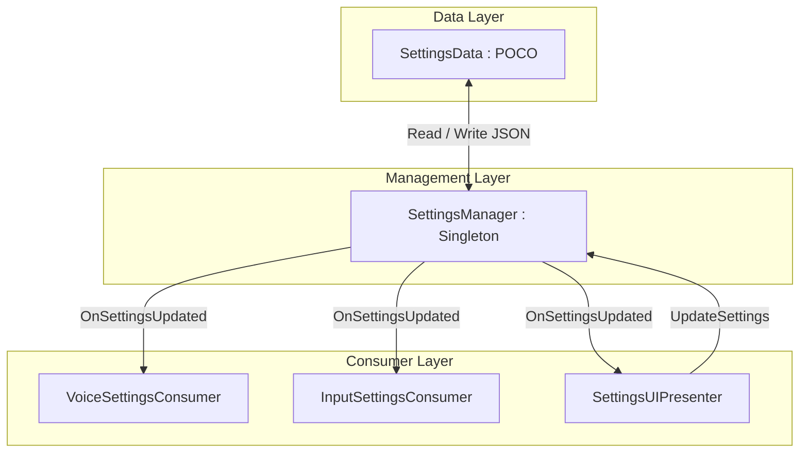

# Settings Management System

This document outlines the design, architecture, and implementation details of the global **Settings Manager** system.

---

## 1. Architectural Overview

The settings system is built around three core principles:
1. **Single Source of Truth (SSOT)**: A single serializable data structure (`SettingsData`) holds all user settings. No other script maintains independent duplicates of settings values.
2. **KISS & Decoupled Observation**: Systems subscribe to settings updates by implementing the `ISettingsConsumer` interface. The `SettingsManager` automatically handles loading, saving, and distributing updates.
3. **Robust Extensibility**: New settings (controls, graphics quality, game preferences) can be added to the data class without altering the core persistence or routing logic.

---

## 2. Core Components

### A. Settings Data ([SettingsData.cs](file:///c:/Users/celestin/Unity%20Games/VacuumProtocol/Assets/1_Scripts/Core/Settings/SettingsData.cs))
* **Rôle** : Plain Old C# Object (POCO) contenant l'ensemble des données de configuration (volumes, sensibilité, périphérique micro, rebinding).
* **Sérialisation des Dictionnaires** : L'utilitaire JSON d'Unity (`JsonUtility`) ne prend pas en charge les dictionnaires natifs (`Dictionary<int, float>`). `SettingsData` implémente `ISerializationCallbackReceiver` pour copier automatiquement le dictionnaire vers deux listes sérialisables (`_peerVolumeKeys` et `_peerVolumeValues`) lors de la sauvegarde, et le reconstruire lors du chargement.

### B. Consommation Découplée ([ISettingsConsumer.cs](file:///c:/Users/celestin/Unity%20Games/VacuumProtocol/Assets/1_Scripts/Core/Settings/ISettingsConsumer.cs))
* **Rôle** : Interface de base imposant la méthode `OnSettingsUpdated(SettingsData settings)`. Tout système dépendant des préférences utilisateur l'implémente pour réagir dynamiquement aux modifications.

### C. Gestionnaire Centralisé ([SettingsManager.cs](file:///c:/Users/celestin/Unity%20Games/VacuumProtocol/Assets/1_Scripts/Core/Settings/SettingsManager.cs))
* **Rôle** : Singleton persistant (hérite de `MonoBehaviour` avec `DontDestroyOnLoad`).
* **Fonctions** :
  * `LoadSettings()` / `SaveSettings()` : Persiste les données au format JSON dans les `PlayerPrefs`.
  * `RegisterConsumer()` / `UnregisterConsumer()` : Enregistre les consommateurs et leur envoie la configuration active dès leur connexion.
  * `UpdateSettings(Action<SettingsData>)` : Permet aux interfaces UI d'exécuter des modifications (via expressions lambda) sur l'état, puis déclenche la sauvegarde et la notification globale.

---

## 3. VoIP & Audio Settings Integration

L'intégration audio est gérée par le pont **[VoiceSettingsConsumer.cs](file:///c:/Users/celestin/Unity%20Games/VacuumProtocol/Assets/1_Scripts/Audio/VoiceSettingsConsumer.cs)**.

### A. Changement de Microphone à Chaud
Lors du changement du périphérique actif :
1. Le script arrête l'enregistrement en cours sur les périphériques de capture matérielle `Adrenak.UniMic.Mic`.
2. Il démarre l'enregistrement sur le nouveau périphérique sélectionné à 60 FPS.
3. Il crée une nouvelle instance de `UniMicInput` et remplace dynamiquement l'entrée de la session VoIP : `UniVoiceMirrorSetupSample.ClientSession.Input = newInput`.

*Note historique : Pour effectuer ce changement et accéder aux variables, nous utilisons notre classe locale `UniVoiceMirrorSetupSample` plutôt que celle du package (qui est stockée en lecture seule dans `Library/PackageCache/...` et ne peut pas être modifiée pour exposer les données ou corriger le comportement du Host ID).*

### B. Sensibilité Vocale (Gate)
Pour filtrer le bruit de fond, UniVoice s'appuie sur son détecteur d'activité vocale (`SimpleVad`). Le paramètre de sensibilité (0.0 à 1.0) est traduit en décibels et injecté dynamiquement dans les propriétés de calcul du VAD via réflexion C# (accès au champ privé `_config` de l'instance `LocalVad`) :
* `SnrEnterDb` (seuil d'activation de la parole) : $2.0\text{ dB} + (\text{sensibilité} \times 30.0\text{ dB})$
* `SnrExitDb` (seuil de coupure) : `SnrEnterDb - 4.0 dB` (hystérésis de sécurité).

### C. Formule de Volume Combiné
Le volume sonore d'un joueur distant sur son `AudioSource` de voix est calculé ainsi :
$$\text{VolumeFinal} = \text{MasterVolume} \times \text{VoiceVolume} \times \text{Multiplier}_{\text{Joueur}}$$

---

## 4. Key Rebinding Strategy

La gestion des commandes s'appuie sur le pont **[InputSettingsConsumer.cs](file:///c:/Users/celestin/Unity%20Games/VacuumProtocol/Assets/1_Scripts/Player/Controller/InputSettingsConsumer.cs)**.

* **Rebinding Interactif** : Utilise la classe `PerformInteractiveRebinding` du nouveau Input System de Unity pour écouter la prochaine touche pressée par l'utilisateur (en excluant les clics souris pour éviter les configurations accidentelles).
* **Sauvegarde des Surcharges** : Une fois la touche réassignée, les surcharges sont exportées au format JSON via `InputActionAsset.SaveBindingOverridesAsJson()` et sauvegardées dans `SettingsData.ControlBindingsOverrideJson`.
* **Rétablissement** : Permet une réinitialisation complète des commandes en supprimant toutes les surcharges d'un coup (`RemoveAllBindingOverrides()`).

---

## 5. UI Presenter & Live Level Meter

Le composant **[SettingsUIPresenter.cs](file:///c:/Users/celestin/Unity%20Games/VacuumProtocol/Assets/1_Scripts/UI/SettingsUIPresenter.cs)** pilote l'interface graphique :

### A. Liaison UGUI
* Remplit dynamiquement la liste déroulante (`Dropdown`) avec les microphones disponibles matériels via `Mic.AvailableDevices`.
* Écoute les modifications des sliders et applique les changements dans le `SettingsManager` en temps réel.

### B. Calcul de Volume en Temps Réel (RMS)
Pour animer l'indicateur de capture vocale (type Discord) :
* Le script s'abonne à l'événement `OnFrameReady` du microphone local.
* Il calcule la valeur **RMS (Root-Mean-Square)** en temps réel sur la trame d'échantillons reçue :
  $$\text{RMS} = \sqrt{\frac{1}{N} \sum_{i=1}^{N} x_i^2}$$
* **Sécurité des Threads** : Ce callback de capture s'exécute sur le thread d'arrière-plan du microphone. Pour éviter les crashs de Unity (qui interdit la manipulation d'UI en dehors du thread principal), la valeur RMS calculée est stockée dans un champ simple, puis lissée et appliquée à l'UI dans la méthode principale `Update()`.

---

## 6. Guide d'Installation dans Unity

1. **Manager Central** : Créez un GameObject nommé `SettingsManager` dans votre première scène de chargement et attachez-y le script [SettingsManager.cs](file:///c:/Users/celestin/Unity%20Games/VacuumProtocol/Assets/1_Scripts/Core/Settings/SettingsManager.cs). Il persistera à travers tous les niveaux.
2. **Intégration Audio** : Créez un GameObject ou ajoutez le script [VoiceSettingsConsumer.cs](file:///c:/Users/celestin/Unity%20Games/VacuumProtocol/Assets/1_Scripts/Audio/VoiceSettingsConsumer.cs) sur le même objet qui gère l'audio du jeu.
3. **Intégration Commandes** : Ajoutez le script [InputSettingsConsumer.cs](file:///c:/Users/celestin/Unity%20Games/VacuumProtocol/Assets/1_Scripts/Player/Controller/InputSettingsConsumer.cs) dans votre scène et assignez votre asset de contrôles `.inputactions` dans son champ `_inputActions`.
4. **Interface Graphique (UI)** :
   * Ouvrez votre préfabrique ou canvas de Menu Paramètres.
   * Attachez le script [SettingsUIPresenter.cs](file:///c:/Users/celestin/Unity%20Games/VacuumProtocol/Assets/1_Scripts/UI/SettingsUIPresenter.cs) sur le panneau principal.
   * Glissez-déposez les références de vos Sliders (Master, Voice, Sensibilité), le Dropdown de sélection du micro, et le Slider ou Image représentant le volume temps réel dans les champs correspondants de l'inspecteur.
