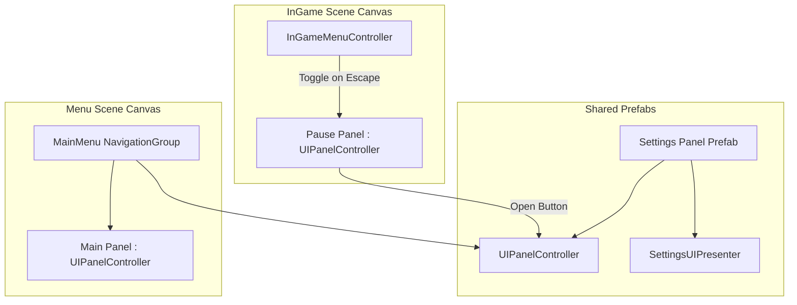

# UI Navigation & Page Management System

This document outlines the architecture, component roles, and implementation guidelines for the modular **UI Navigation System**.

---

## 1. Architectural Philosophy (Decoupling)

To prevent tight coupling between screens and menus, the system divides UI management into independent, single-responsibility components:

1. **Visual State (`UIPanelController`)**: Handles its own animations (fade/scale via DOTween), block state, and active flags. It does not know who opens it or what other panels exist.
2. **Layout Mutex (`UINavigationGroup`)**: Coordinates switching between panels that belong to the same group (e.g. play, settings, credits in the Main Menu), ensuring only one is open at a time.
3. **Trigger Gating (`InGameMenuController`)**: Listens to input (Escape key) and toggles the in-game Pause Panel.

---

## 2. Reusability: Reusable Panel Prefabs

The **Settings Panel** is designed as a self-contained **Prefab**:
* It contains the visual sliders, dropdowns, level indicators, and the `SettingsUIPresenter` script.
* It has a `UIPanelController` attached to its root.
* You can drop this Prefab into both the **MainMenu Canvas** and the **InGame Canvas** scene hierarchies.
* When the Main Menu's "Settings" button is clicked, it calls `Show()` on the main menu instance. When the Pause Menu's "Settings" button is clicked, it calls `Show()` on the in-game instance.
* Because the underlying `SettingsUIPresenter` hooks directly into the persistent `SettingsManager.Instance` upon enabling, both instances are synchronized out-of-the-box.

---

## 3. Core Components

### A. UI Panel Controller ([UIPanelController.cs](file:///c:/Users/celestin/Unity%20Games/VacuumProtocol/Assets/1_Scripts/UI/UIPanelController.cs))
Manages smooth open/close fade and zoom animations on an individual panel.
* **CanvasGroup Gating**: Automatically locks inputs (`interactable = false`) and raycasts (`blocksRaycasts = false`) when closed to prevent clicking invisible UI buttons.
* **DOTween Transitions**: Scales from `_hiddenScale` (default 0.8) and fades alpha from 0.0 to 1.0 when opened.
* **Pause Menu Safety**: All tweens utilize `.SetUpdate(true)` so that transitions execute even when the game is paused (`Time.timeScale = 0`).

### B. UI Navigation Group ([UINavigationGroup.cs](file:///c:/Users/celestin/Unity%20Games/VacuumProtocol/Assets/1_Scripts/UI/UINavigationGroup.cs))
Orchestrates mutual exclusivity of panels within a single layout.
* **History Stack**: Maintains a `Stack<UIPanelController>` history of visited pages to support simple, robust "Back" button navigation.
* **Default Display**: Automatically closes all sibling panels on start and opens the designated `_defaultPanel`.

### C. In-Game Menu Controller ([InGameMenuController.cs](file:///c:/Users/celestin/Unity%20Games/VacuumProtocol/Assets/1_Scripts/UI/InGameMenuController.cs))
Bridge between input events and pause layouts.
* **Input System Support**: Evaluates input flags (supports both Unity New Input System `Keyboard.current` and legacy `Input.GetKeyDown` fallbacks).
* **Escape Gating**: Pressing Escape opens/closes the pause menu. If a sub-panel (like Settings) is currently active, Escape closes that subpanel first before closing the main pause menu.

---

## 4. Unity Editor Setup Guide

### A. Creating a Reusable Settings Panel Prefab
1. Under your Canvas, create a panel GameObject named **`SettingsPanel`**.
2. Add a **`CanvasGroup`** component to it.
3. Attach the **`UIPanelController`** and **`SettingsUIPresenter`** scripts to it.
4. Add your child UI elements (Sliders for volumes, Dropdown for micro, Slider for level indicator) and bind them to the `SettingsUIPresenter` inspector slots.
5. Drag and drop the `SettingsPanel` GameObject into your project folder to save it as a **Prefab**.

### B. Wiring the Main Menu Scene
1. Drop the `SettingsPanel` prefab under your main menu Canvas.
2. Create your Main Menu panel (containing Play/Settings/Quit buttons) and attach a `UIPanelController` to it. Set `Start Opened` to true.
3. Create a GameObject named `MainMenuNavigationGroup`, attach `UINavigationGroup`, and drag the Main Menu Panel and Settings Panel into the `_panels` list. Set the Main Menu Panel as the `_defaultPanel`.
4. On your main menu's "Settings" button, add an On Click callback pointing to `MainMenuNavigationGroup.OpenPanel` and drag the Settings Panel prefab instance into the parameter slot.

### C. Wiring the In-Game Scene
1. Drop the same `SettingsPanel` prefab under your In-Game HUD Canvas. Set `Start Opened` to false.
2. Create a pause menu panel GameObject (e.g. `PausePanel`) and attach a `UIPanelController` to it.
3. Create an empty GameObject named `InGameMenuController`, attach `InGameMenuController.cs`, and drag `PausePanel` and `SettingsPanel` into their respective inspector fields.
4. On your pause menu's "Settings" button, add an On Click callback pointing to `SettingsPanel.Show()`.
5. On your settings panel's "Back/Close" button, add a callback pointing to `SettingsPanel.Hide()`.
