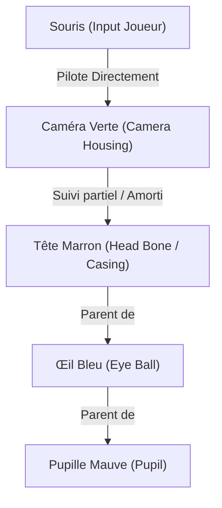

# Spécifications Techniques : Mécanique de la Tête et Système de Vision du Robot Vacuum

Ce document détaille le fonctionnement mécanique, physique et visuel de la tête du robot aspirateur, contrôlé par la souris du joueur et réactif à l'environnement.

---

## 1. Structure & Hiérarchie de Contrôle

Le système de la tête est composé de 4 éléments imbriqués hiérarchiquement. Contrairement à un système classique où la tête guide la caméra, ici le contrôle s'effectue dans l'ordre suivant :



### Règles d'alignement et de contrôle :
* **Caméra Verte** : Entièrement pilotée par la souris du joueur (100% de la direction visée). Elle ne subit pas de snapping ou de saccades brusques face aux objets ciblés car elle est sous le contrôle fluide du joueur.
* **Tête Marron** : Suit l'orientation de la caméra verte mais **de manière atténuée** (ex: 70% de l'amplitude totale) et avec une inertie physique.
* **Œil Bleu** (globe oculaire) : S'oriente à **75%** vers l'objet cible détecté dans la zone `PlayerViewRange` (par rapport à son repère parent).
* **Pupille Mauve** : Vise à **100%** (verrouillage parfait) sur l'objet cible (depuis le globe oculaire).

---

## 2. Physique de la Tête : Setup avec Rigidbody et ConfigurableJoint

Pour obtenir un effet de **ressort vertical flexible ("boing boing")** réactif aux collisions et aux forces physiques d'Unity, nous devons utiliser les composants physiques natifs : un **Rigidbody** sur la tête et un **ConfigurableJoint** connecté au buste.

```
       [ Tête Marron ] (Rigidbody + Collider)
             |
     [ ConfigurableJoint ] (Ressort de torsion + translation)
             |
       [   Buste   ] (Rigidbody parent)
```

### A. Configuration du ConfigurableJoint dans l'inspecteur Unity

Pour la **Tête Marron** :
1. **Rigidbody** :
   * `Mass` : Détermine l'inertie de la tête (ex: 1.0).
   * `Drag` & `Angular Drag` : Très faibles pour maximiser le balancement "boing boing" (ex: 0.05).
   * `Interpolate` : Régler sur **Interpolate** pour des mouvements fluides à l'écran.
2. **ConfigurableJoint** :
   * `Connected Body` : Assigner le Rigidbody du **Buste** (ou le Rigidbody racine du joueur).
   * **Mouvements Linéaires (Translations)** :
     * `X Motion` & `Z Motion` : Régler sur **Locked** (la tête reste centrée verticalement sur son axe).
     * `Y Motion` : Régler sur **Limited** (pour permettre l'affaissement du crouch). Configurer la limite (`Linear Limit -> Limit`) correspondant à l'affaissement max (ex: 0.25m).
   * **Mouvements Angulaires (Rotations/Flexions)** :
     * `Angular X Motion` (Pitch) & `Angular Y/Z Motion` (Yaw/Roll) : Régler sur **Free** ou **Limited** (permet à la tête de se tordre et s'incliner sous l'effet du ressort).
   * **Drives de Ressort (Moteur physique)** :
     * **Pour la translation Y (Crouch)** : Activer le `Y Drive`. Configurer un `Position Spring` élevé (ex: 800) et un `Position Damper` modéré (ex: 30). Ce ressort tirera la tête vers le bas en position de crouch.
     * **Pour la rotation (Boing Boing)** : Configurer le `Rotation Drive` en mode **Slerp** (plus simple pour gérer toutes les directions). Dans `Slerp Drive`, configurer un `Position Spring` faible/modéré (ex: 150) et un `Position Damper` très faible (ex: 5). C'est ce faible amortissement qui va créer l'oscillation "boing boing" naturelle lors des chocs.

---

### B. Contrôle du Ressort via Script (C#)

Dans le script de contrôle de la tête, nous ne manipulons pas directement les angles ou les positions du Transform. Nous modifions les propriétés **`targetRotation`** (visée de la souris) et **`targetPosition`** (crouch et arc de cercle) du `ConfigurableJoint`.

#### 1. Tordre le ressort (Visée de la souris) :
Pour orienter la tête vers la visée de la caméra, on assigne un Quaternion à `targetRotation`.
*Comme les ressorts de rotation du joint (`Slerp Drive`) sont actifs, le Rigidbody de la tête va chercher à s'aligner sur cette rotation cible avec l'élasticité physique voulue. Toute collision ou accélération du joueur perturbera temporairement cette orientation, créant l'oscillation automatique.*

#### 2. Compresser le ressort (Crouch & Arc de Cercle) :
Pour s'accroupir ou forcer le glissement en arc de cercle le long du buste, on assigne un `Vector3` à `targetPosition` (qui représente le décalage local par rapport à l'ancre).

```csharp
using UnityEngine;

/// <summary>
/// Gère le comportement physique élastique de la tête du Robot Vacuum à l'aide d'un ConfigurableJoint.
/// </summary>
[RequireComponent(typeof(ConfigurableJoint))]
public class PhysicalHeadController : MonoBehaviour
{
    [Header("Paramètres de Suivi")]
    [SerializeField, Range(0f, 1f)] private float _followRatio = 0.7f; // La tête suit 70% de la caméra
    [SerializeField] private float _arcRadius = 0.2f;                 // Rayon de l'arc de cercle du cou
    [SerializeField] private float _sagFactor = 0.05f;                // Affaissement Y lors des fortes inclinaisons

    [Header("Références")]
    [SerializeField] private Transform _cameraTransform;             // Caméra pilotée directement par le joueur

    private ConfigurableJoint _joint;
    private float _crouchYOffset = 0f;                                // Géré par les inputs du joueur pour s'accroupir

    private void Start()
    {
        _joint = GetComponent<ConfigurableJoint>();
    }

    /// <summary>
    /// Permet de modifier le décalage d'accroupissement depuis un script externe (ex: PlayerController).
    /// </summary>
    public void SetCrouchOffset(float crouchOffset)
    {
        _crouchYOffset = crouchOffset;
    }

    private void FixedUpdate()
    {
        if (_cameraTransform == null) return;

        // 1. OBTENIR L'ORIENTATION CIBLE DE LA CAMÉRA (Locale par rapport au buste/parent du joint)
        Quaternion relativeCamRot = Quaternion.Inverse(transform.parent.rotation) * _cameraTransform.rotation;
        
        // Extraire le Pitch et Yaw de la caméra, et appliquer le ratio d'amplitude
        Vector3 camAngles = relativeCamRot.eulerAngles;
        // Normaliser les angles de -180 à 180
        float pitch = Mathf.DeltaAngle(0f, camAngles.x) * _followRatio;
        float yaw = Mathf.DeltaAngle(0f, camAngles.y) * _followRatio;
        float roll = 0f; // On laisse la physique gérer le roulis (le ballottement latéral)

        // Rotation cible de la tête
        Quaternion targetRot = Quaternion.Euler(pitch, yaw, roll);

        // CONFIGURABLE JOINT ASTUCE : targetRotation doit être exprimé dans l'espace local de l'ancre.
        // Si le joint est orienté de manière standard, targetRot est suffisant.
        _joint.targetRotation = targetRot;

        // 2. CALCULER LA POSITION CIBLE (Crouch Y + Arc de Cercle)
        float pitchRad = pitch * Mathf.Deg2Rad;
        
        // Translation en arc de cercle sur Z (avant/arrière) et Y (haut/bas)
        float arcZ = _arcRadius * Mathf.Sin(pitchRad);
        float arcY = -_arcRadius * (1f - Mathf.Cos(pitchRad)) - _sagFactor * Mathf.Abs(Mathf.Sin(pitchRad));

        // targetPosition représente le décalage local (attention, le signe Y dépend de l'ancre du joint)
        // On additionne l'accroupissement (_crouchYOffset) et l'affaissement de l'arc (arcY)
        _joint.targetPosition = new Vector3(0f, _crouchYOffset - arcY, -arcZ);
    }
}
```

> [!TIP]
> Avec ce système, les collisions physiques avec les décors ou d'autres joueurs vont naturellement "tordre" ou "écraser" le joint de la tête. Dès que le choc se termine, le moteur de forces internes du joint (`Slerp Drive` et `Y Drive`) ramène élastiquement la tête vers la position/rotation visée, créant un comportement "boing boing" ultra-satisfaisant 100% physique.

---

## 4. Système de Vision Hiérarchique & Alignement Partiel

Lorsqu'un objet est détecté dans la portée visuelle (`PlayerViewRange`) :
1. La **Caméra** reste sous le contrôle fluide de la souris du joueur.
2. La **Tête** suit le mouvement amorti de la caméra via le ConfigurableJoint.
3. L'**Œil** et la **Pupille** ajustent leur regard vers l'objet cible selon leurs ratios d'accomplissement :

### Ratios d'Accomplissement Visuel :

| Composant | Contrôlé par | Alignment sur la Cible | Comportement |
| :--- | :--- | :---: | :--- |
| **Caméra (Verte)** | Souris (Joueur) | *N/A* (100% Souris) | Orientée directement par la souris. |
| **Tête (Marron)** | Caméra / Physique | *N/A* (Ressort physique) | Suit la caméra avec le ConfigurableJoint. |
| **Œil (Bleu)** | Cible (Thing) | **75%** | S'oriente partiellement (regard de côté). |
| **Pupille (Mauve)** | Cible (Thing) | **100%** | Se centre parfaitement pour verrouiller la cible. |

```
[Visée Souris] ──> Caméra (100%)
                     └──> Tête (ConfigurableJoint - Suivi amorti + Boing)
                            └──> Œil (75% vers Thing)
                                   └──> Pupille (100% vers Thing)
```

### Implémentation de l'Alignement Partiel :
Pour orienter l'œil à 75% et la pupille à 100% vers la cible :

```csharp
private void UpdateEyeAndPupilTracking(Vector3 targetWorldPos)
{
    // 1. Alignement de l'œil (75% vers la cible)
    AlignComponent(eyeTransform, targetWorldPos, 0.75f);
    
    // 2. Alignement de la pupille (100% vers la cible)
    // Note : Comme la pupille est enfant de l'œil, elle doit compenser 
    // la rotation de 75% de son parent pour atteindre 100% d'alignement réel.
    AlignComponent(pupilTransform, targetWorldPos, 1.00f);
}

private void AlignComponent(Transform component, Vector3 targetWorldPos, float alignmentPercent)
{
    Vector3 toTarget = (targetWorldPos - component.position).normalized;
    Quaternion targetWorldRot = Quaternion.LookRotation(toTarget, component.parent.up);
    
    // Conversion en coordonnées locales par rapport au parent
    Quaternion targetLocalRot = Quaternion.Inverse(component.parent.rotation) * targetWorldRot;
    
    // Application de la rotation slerpée selon le pourcentage requis
    component.localRotation = Quaternion.Slerp(Quaternion.identity, targetLocalRot, alignmentPercent);
}
```
